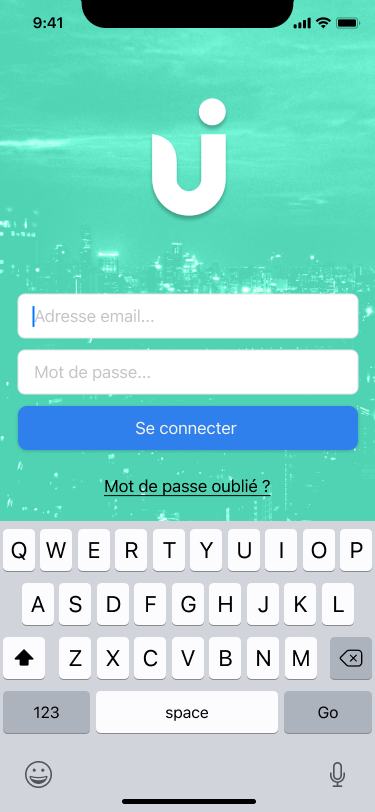

Test Technique iOS
---

Pour iPhone, réaliser l'écran de connexion selon le mock suivant.

Les ressources visuelles sont disponibles dans le dépôt.

Vous pouvez utiliser https://reqres.in/ pour effectuer les requêtes de login sur une vraie API.

Pour le rendu, vous pouvez passer par un dépôt GitHub et y inviter @maximelebastard.

Bonne chance :)

